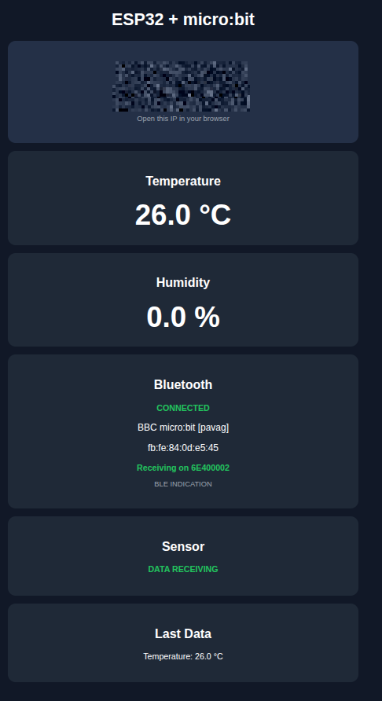

# ESP32 + micro:bit Environmental Monitor

A wireless environmental monitoring system using a **BBC micro:bit**, **ESP32**, **Bluetooth Low Energy (BLE)**, and a built-in **ESP32 Web Server**.

The micro:bit reads environmental sensor data and transmits it to the ESP32 using the **Nordic UART Service (NUS)** over Bluetooth. The ESP32 receives the data and provides a web dashboard accessible from any device connected to the same Wi-Fi network.



---

## Features

* 📡 **BLE communication** between micro:bit and ESP32
* 🌡️ Temperature measurement from the micro:bit
* 💧 Humidity measurement from the micro:bit
* 🔌 Nordic UART Service (NUS) communication
* 📶 ESP32 Wi-Fi connectivity
* 🌐 Built-in ESP32 Web Server
* 🖥️ Real-time environmental monitoring dashboard
* 🔍 Automatic micro:bit discovery
* 🔗 Automatic BLE connection
* 📊 Sensor communication status
* 💾 Displays the last received sensor data
* 🟢 BLE connection status
* 📱 Dashboard accessible from a browser

---

## System Architecture

```text
             ┌──────────────────────┐
             │      micro:bit       │
             │                      │
             │  Temperature Sensor  │
             │  Humidity Sensor     │
             │                      │
             └──────────┬───────────┘
                        │
                        │ Bluetooth LE
                        │ Nordic UART
                        ▼
             ┌──────────────────────┐
             │        ESP32         │
             │                      │
             │   BLE Client         │
             │   NUS Receiver       │
             │   Wi-Fi              │
             │   Web Server         │
             └──────────┬───────────┘
                        │
                        │ Wi-Fi
                        ▼
             ┌──────────────────────┐
             │   Web Browser        │
             │                      │
             │ Temperature          │
             │ Humidity             │
             │ BLE Status            │
             │ Last Data            │
             └──────────────────────┘
```

---

## Communication

The project uses the **Bluetooth Low Energy Nordic UART Service**.

### Nordic UART Service

| Component         | UUID                                   |
| ----------------- | -------------------------------------- |
| NUS Service       | `6E400001-B5A3-F393-E0A9-E50E24DCCA9E` |
| TX Characteristic | `6E400002-B5A3-F393-E0A9-E50E24DCCA9E` |
| RX Characteristic | `6E400003-B5A3-F393-E0A9-E50E24DCCA9E` |

In this project:

```text
micro:bit
    │
    │ sends sensor data
    ▼
NUS TX characteristic
    │
    ▼
ESP32 receives notification
```

The ESP32 acts as the **BLE central/client**, while the micro:bit provides the BLE UART service.

---

## Data Flow

The complete data path is:

```text
Temperature Sensor
        │
        ▼
     micro:bit
        │
        │ BLE / NUS
        ▼
      ESP32
        │
        ├── Parse received data
        │
        ├── Store temperature
        │
        ├── Store humidity
        │
        └── Update Web Server
                 │
                 ▼
             Browser
```

---

## Example Sensor Message

The micro:bit can transmit sensor data as a text message.

For example:

```text
TEMP:27.0,HUM:65.0
```

The ESP32 receives this message through the BLE notification callback and extracts the sensor values.

The dashboard then displays:

```text
Temperature
27.0 °C

Humidity
65.0 %
```

---

## ESP32 Web Dashboard

After connecting to Wi-Fi, the ESP32 starts an HTTP server.

The serial monitor displays the ESP32 IP address, for example:

```text
ESP32 IP Address: 192.168.0.69
```

Open the address in a browser:

```text
http://192.168.0.69
```

The dashboard provides:

### ESP32 Server IP

Displays the current IP address of the ESP32.

### Temperature

Displays the latest temperature received from the micro:bit.

Example:

```text
27.0 °C
```

### Humidity

Displays the latest humidity received from the micro:bit.

Example:

```text
65.0 %
```

### Bluetooth

Shows the BLE connection status.

Example:

```text
CONNECTED

BBC micro:bit [pavag]
fb:fe:84:0d:e5:45

Receiving on 6E400002
```

### Sensor

Indicates whether sensor data is being received.

```text
DATA RECEIVING
```

### Last Data

Displays the most recently received sensor values.

---

## Hardware

### Required Components

* ESP32 development board
* BBC micro:bit
* Temperature/humidity sensor

  * DHT11, DHT22, or compatible sensor
* Jumper wires
* USB cables
* Wi-Fi network

---

## Software

### ESP32

The ESP32 firmware can be developed using:

* Arduino IDE
* PlatformIO
* Arduino ESP32 Core
* BLE library / NimBLE-Arduino
* `WiFi.h`
* `WebServer.h`

### micro:bit

The micro:bit can be programmed using:

* Microsoft MakeCode
* Bluetooth extension
* UART Service

---

## ESP32 Wi-Fi Configuration

Configure the Wi-Fi credentials in the ESP32 source code:

```cpp
const char* WIFI_SSID     = "YOUR_WIFI_SSID";
const char* WIFI_PASSWORD = "YOUR_WIFI_PASSWORD";
```

Replace the values with your local network credentials.

For example:

```cpp
const char* WIFI_SSID     = "MyNetwork";
const char* WIFI_PASSWORD = "MyPassword";
```

**Do not commit real Wi-Fi passwords to a public Git repository.**

A better approach is to keep credentials in a separate configuration file that is excluded using `.gitignore`.

---

## BLE Connection Process

When the ESP32 starts, it performs the following process:

```text
1. Initialize BLE
       │
       ▼
2. Scan for BLE devices
       │
       ▼
3. Find micro:bit
       │
       ▼
4. Connect to micro:bit
       │
       ▼
5. Search for NUS service
       │
       ▼
6. Find NUS characteristic
       │
       ▼
7. Register notification callback
       │
       ▼
8. Receive sensor data
       │
       ▼
9. Update web dashboard
```

---

## micro:bit BLE

The micro:bit should start the Bluetooth UART service.

Conceptually, the micro:bit performs:

```text
Start Bluetooth
       │
       ▼
Start UART Service
       │
       ▼
Read sensor
       │
       ▼
Create message
       │
       ▼
Send through UART
       │
       ▼
ESP32
```

Example MakeCode logic:

```javascript
bluetooth.startUartService()

basic.forever(function () {
    let temperature = input.temperature()

    bluetooth.uartWriteString(
        "TEMP:" + temperature + "\n"
    )

    basic.pause(2000)
})
```

If a humidity sensor is connected, the message can contain both values:

```text
TEMP:27.0,HUM:65.0
```

---

## BLE Debugging

The ESP32 serial monitor should provide information similar to:

```text
========================================
SCANNING FOR MICRO:BIT
========================================

Devices found: 5

Device:
Name: BBC micro:bit [pavag]
Address: fb:fe:84:0d:e5:45

TARGET MICRO:BIT FOUND!

CONNECTING...

BLE: Client connected
BLE: Physical connection OK

NORDIC UART SERVICE FOUND

RX CHARACTERISTIC FOUND

MICRO:BIT CONNECTED!
```

After successful notification registration:

```text
Receiving on 6E400002
```

When sensor data arrives:

```text
Temperature: 27.0 °C
Humidity: 65.0 %
```

---

## Project Status

The current implementation successfully demonstrates:

| Component               | Status                       |
| ----------------------- | ---------------------------- |
| ESP32 Wi-Fi             | ✅ Working                    |
| ESP32 Web Server        | ✅ Working                    |
| Web Dashboard           | ✅ Working                    |
| micro:bit BLE discovery | ✅ Working                    |
| BLE connection          | ✅ Working                    |
| Nordic UART Service     | ✅ Working                    |
| Sensor data reception   | ✅ Working                    |
| Temperature display     | ✅ Working                    |
| Humidity display        | 🔧 Depends on sensor/message |
| Real-time monitoring    | ✅ Working                    |

---

## Troubleshooting

### Temperature appears but humidity is `0.0 %`

If the dashboard displays:

```text
Temperature
27.0 °C

Humidity
0.0 %
```

the BLE connection is probably working correctly.

The problem is likely in the **sensor data message or parsing**.

Check the ESP32 serial monitor for the exact message received from the micro:bit.

For example:

```text
BLE RX: TEMP:27.0,HUM:65.0
```

If only this is received:

```text
BLE RX: TEMP:27.0
```

then the ESP32 cannot obtain humidity from that message.

---

### ESP32 connects but receives no data

Check that the micro:bit:

1. Has Bluetooth enabled.
2. Starts the UART service.
3. Is transmitting data.
4. Uses the expected NUS service.
5. Sends data periodically.

Also verify that the ESP32 has successfully registered for notifications.

---

### micro:bit is visible but NUS is not found

Make sure the micro:bit program contains:

```javascript
bluetooth.startUartService()
```

The ESP32 should search for:

```text
6E400001-B5A3-F393-E0A9-E50E24DCCA9E
```

---

### Web page does not open

Check the ESP32 serial monitor for:

```text
WiFi connected
IP address: 192.168.x.x
```

Then open:

```text
http://192.168.x.x
```

The computer or smartphone must be connected to the same local network as the ESP32.

---

## Security Notes

This project is designed for a local Wi-Fi network.

Do not publish the following information in a public repository:

```text
Wi-Fi password
Private network credentials
API keys
Cloud credentials
Private certificates
```

Use placeholders in the source code:

```cpp
const char* WIFI_SSID     = "YOUR_WIFI_SSID";
const char* WIFI_PASSWORD = "YOUR_WIFI_PASSWORD";
```

---

## Future Improvements

Possible extensions include:

* 📈 Real-time temperature/humidity charts
* 💾 Store sensor measurements in a database
* ⏱️ Add timestamps to measurements
* 📊 Historical sensor graphs
* 📱 Responsive mobile dashboard
* 🔔 Temperature/humidity alerts
* ☁️ MQTT integration
* ☁️ Cloud data storage
* 🗄️ PostgreSQL/SQLite integration
* 📡 Multiple micro:bit sensors
* 🔄 Automatic BLE reconnection
* 📥 CSV data export
* 🔐 Web authentication
* 🌡️ Support for additional sensors

---

## Example Dashboard

The current dashboard provides a simple monitoring interface:

```text
┌─────────────────────────────────────┐
│          ESP32 + micro:bit          │
├─────────────────────────────────────┤
│          ESP32 Server IP            │
│             192.168.0.69            │
├─────────────────────────────────────┤
│             Temperature             │
│               27.0 °C               │
├─────────────────────────────────────┤
│               Humidity              │
│                0.0 %                │
├─────────────────────────────────────┤
│              Bluetooth              │
│              CONNECTED              │
│       BBC micro:bit [pavag]         │
│          fb:fe:84:0d:e5:45          │
│        Receiving on NUS             │
├─────────────────────────────────────┤
│                Sensor               │
│             DATA RECEIVING          │
├─────────────────────────────────────┤
│              Last Data              │
│        Temperature: 27.0 °C         │
└─────────────────────────────────────┘
```

---

## Project Goal

The main goal of this project is to demonstrate an **IoT-style wireless sensor system** using low-cost embedded hardware.

The micro:bit works as the **sensor node**, the ESP32 works as the **BLE gateway and web server**, and the browser provides the **user interface**.

```text
micro:bit
Sensor Node
     │
     │ BLE
     ▼
ESP32
Gateway
     │
     │ Wi-Fi
     ▼
Web Browser
Dashboard
```

---

## License

This project can be adapted for educational, research, and experimental purposes.

Add your preferred open-source license to the repository, for example:

```text
MIT License
```

---

## Author

**André V. Silva**

ESP32 + micro:bit BLE Environmental Monitoring Project